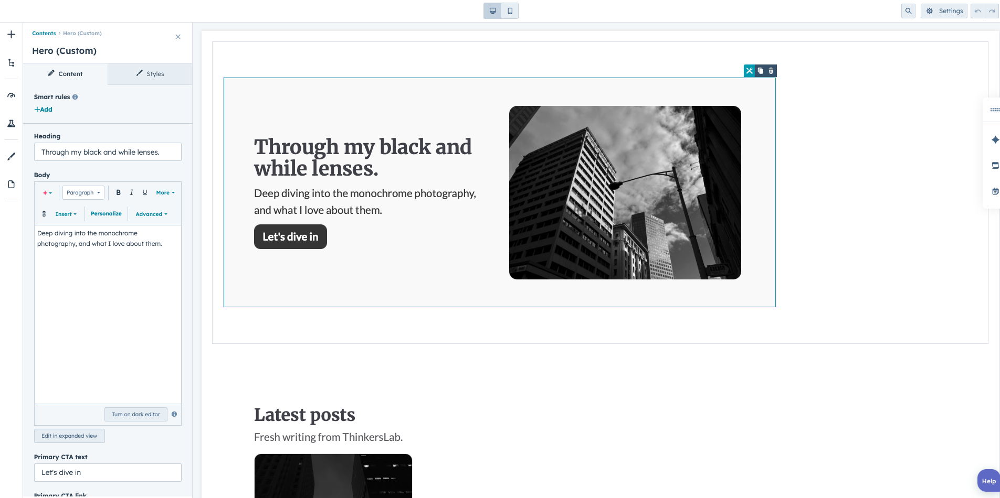
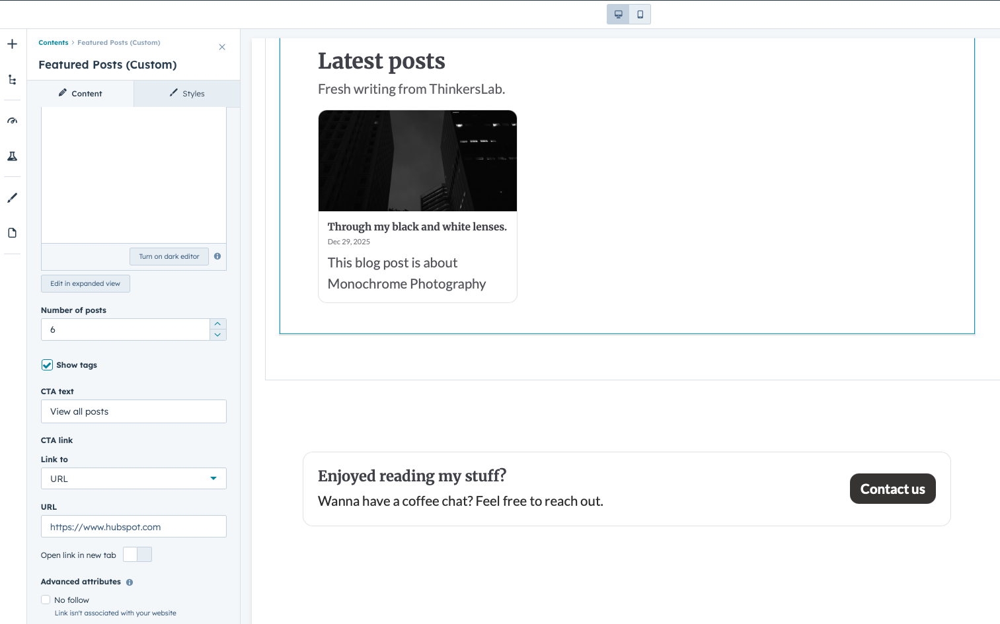
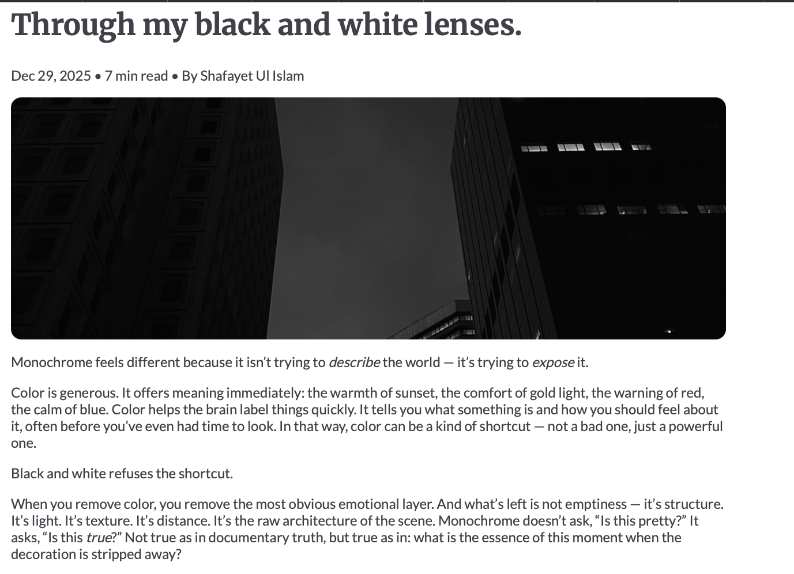

# ShafThinks Blog — HubSpot CMS Theme (Practice Project)

A custom **HubSpot CMS theme** built with **HubL + HTML + CSS** and deployed using the **HubSpot CLI**.  
This project focuses on building a clean blog experience with custom **blog listing** + **blog post** templates, reusable partials, and a configurable header module.

Repo: https://github.com/shafayet98/shafthinksblog

---

## ✨ What I Built

### ✅ Blog templates
- **Blog Post template** (custom `blog-post.html`)
  - Title, publish date, author
  - Reading time calculation
  - Featured image
  - Tags
  - Share + related posts sections (HubSpot blog modules)

- **Blog Listing template**
  - Lists posts and links to individual blog articles

## Screenshots

### Featured Blog

### Blog Listing

### Blog Post

### ✅ Theme layout + partials
- Base layout (`templates/layouts/base.html`)
- Header partial (`templates/partials/header.html`)
- Footer partial (`templates/partials/footer.html`)

### ✅ Theme styling
- Base styles: `css/main.css`
- Overrides: `css/theme-overrides.css`

### ✅ Module work
- A reusable **Site Header module** (`modules/site-header.module`)
  - Built to be reusable and (optionally) globally applied

---

## 🧱 Tech Stack

- HubSpot CMS / HubL
- HTML / CSS
- HubSpot CLI

---

## 📁 Project Structure
css/
main.css
theme-overrides.css
js/
main.js
modules/
site-header.module/
module.html
module.css
fields.json
meta.json
templates/
layouts/
base.html
partials/
header.html
footer.html
blog-post.html
blog-listing.html
blog-index.html
theme.json
fields.json

---

## 🚀 Running / Uploading to HubSpot

### HubSpot CLI + Commands
npm i -g @hubspot/cli
hs auth
hs cms upload shafthinksblog shafthinksblog
hs cms watch shafthinksblog shafthinksblog

### 🔧 Assign Templates in HubSpot

In HubSpot:
	1.	Settings → Content → Blog
	2.	Pick your blog under Current view
	3.	Open the Templates tab
	4.	Assign:
	•	Blog Post Template → shafthinksblog/templates/blog-post.html
	•	Blog Listing Page → shafthinksblog/templates/blog-listing.html

### 🧠 Notes / Lessons Learned
	•	HubSpot blog templates must use correct templateType metadata (e.g. blog_article) and cannot contain drag & drop areas unless the template type supports it.
	•	When CSS “doesn’t apply”, the most common causes are:
	•	The CSS file isn’t being loaded (wrong require_css path)
	•	The selector doesn’t match the real DOM classes HubSpot outputs
	•	Another rule is overriding it (use DevTools + increase specificity / !important where appropriate)

### 📌 Possible Improvements
	•	Improve responsive handling for featured images on blog posts
	•	Add mobile navigation to the header module
	•	Add better styling for share + related posts blocks
	•	Add a dedicated “Contact” page section and links